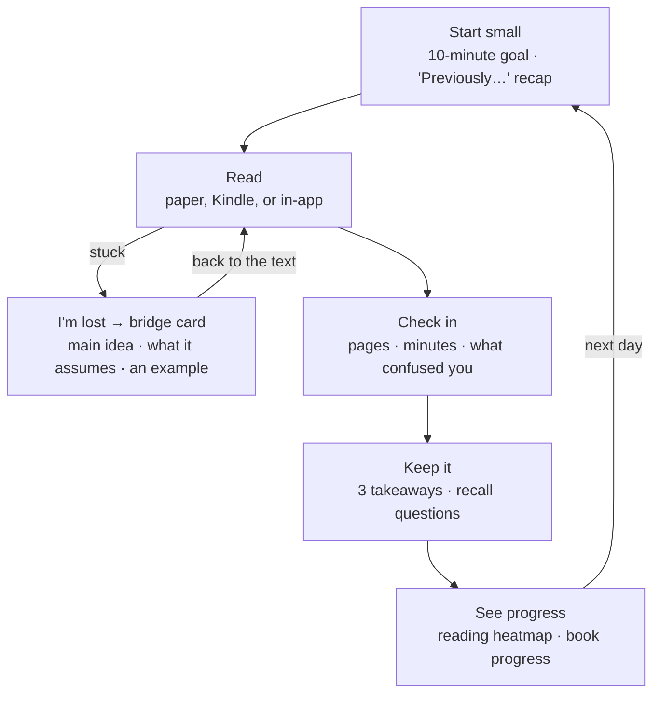

# PLAN — help-me-learn

## Vision

A personal agent that helps me **read more and understand more**, especially books I'd
otherwise give up on, without being tied to any one LLM vendor. v1 built the engine
(upload, summarize, ask, usage dashboard). v2 turns it into a **reading coach** for people
who don't love reading but want to grow through it.

## Guiding principles

- **LLM-agnostic**: every model call goes through a small adapter interface
  (`LLMProvider` / `EmbeddingProvider`). Adding a provider = one new adapter file.
- **Runs with zero keys**: a Mock provider makes the full app testable offline; real keys
  live only in `backend/.env` (gitignored), placeholders in `.env.example`.
- **Everything measured**: every LLM call, failures included, is logged and visible.
- **Scaffold, don't substitute** *(v2)*: the agent helps you read; it doesn't read for you.
  Summaries serve re-entry and review, not replacement.
- **Your day is your day** *(v2)*: anything "per day" (charts, streaks, check-ins) uses the
  reader's local timezone.
- **Explicit signals before inferred ones** *(v2)*: an "I'm lost" tap beats guessing from
  time-on-page; inferred signals may only *offer* help, never interrupt.
- **Per chapter, just in time, cached forever** *(v2)*: LLM cost follows what you actually read.
- **Start small, scale later**: SQLite + numpy now; interfaces allow swapping the store and
  job queue later without touching callers.

## v1 — done (PR #1, merged 2026-09-15)

Monorepo (FastAPI + Next.js), adapters for Mock / OpenAI / DeepSeek / Anthropic / Gemini,
RAG Q&A with citations, map-reduce summaries, usage log + dashboard, README/QUICK-GUIDE.
Verified: 11 backend tests, clean frontend build, browser E2E, live DeepSeek + OpenAI smoke test.

---

## v2 — from "upload & ask" to a reading coach

### Why change direction

People who don't enjoy reading rarely lack summaries. They drop out at predictable points,
and each drop-off maps to one thing the agent can do. **But only if the app knows what you
read and where you struggled.** Today it only sees uploads and questions.

| Where people quit | What the agent does | What it needs to know |
|---|---|---|
| Starting feels like a chore | Offers a 10-minute session with one clear target | Your goal and where you are |
| Coming back after days away | "Previously…": a 30-second recap of last session | What you read last time |
| Hitting a hard part | "I'm lost" → main idea, missing prerequisite, an example | Which section confused you |
| No sense of progress | Reading-days heatmap, book progress | Daily check-ins |
| Forgetting it all | 3 takeaways now, 2 recall questions next session | What you read, your answers |

The loop v2 builds toward:

A **bridge card** is the agent's answer to "I'm lost": the section's main idea in one
sentence, what it assumes you already know (with a 2-minute primer), and one concrete
example. Then it sends you back to the text.

### Audit of v1 (2026-09-25)

Findings come from reading the code, lint (clean), a coverage measurement on a synthetic
400-page book, the stored usage timestamps, and viewing the README on GitHub.

#### Product flaws

**F1 · Book summaries only cover the first 8–12% of a book.**
[summarize.py](backend/app/services/summarize.py#L10-L11) caps input at 10 batches × 12,000
chars. Measured on a 400-page book: the summary stops at page 33 (3,000 chars/page) or
page 50 (2,000 chars/page). The small "truncated" note is easy to miss, and books are the
core use case.
*Fix:* P0 says exactly what was covered ("based on pages 1–50 of 400"). P2 replaces this
with cached per-chapter summaries and a book summary built from them. That needs P1's
background jobs, because a whole book is 100+ calls.

**F2 · "Per day" is UTC, and empty days disappear.**
[usage.py](backend/app/services/usage.py#L102) groups by `date(ts)` on UTC timestamps, and
[dashboard/page.tsx](frontend/src/app/dashboard/page.tsx#L45) builds the date range with
`toISOString()`. At UTC−4, anything after 8 pm counts toward tomorrow. Days with no activity
are omitted, so the timeline compresses, and a one-day range draws the token chart as two
floating dots.
*Why it matters:* the daily picture is wrong now, and later it would break streaks. Evening
is prime reading time.
*Fix (P0):* the frontend sends its IANA timezone. The backend buckets days with `zoneinfo`
and zero-fills the range.

**F3 · Q&A and uploads quietly depend on OpenAI, and part of that isn't logged.**
Every question is embedded via OpenAI ([indexing.py](backend/app/services/indexing.py#L47)),
even when DeepSeek writes the answer. That call isn't logged, so the dashboard under-counts
OpenAI. With no OpenAI credit, Q&A "with DeepSeek" fails with an OpenAI error.
*Fix:* P0 logs query embeddings and says in plain words which service powers search.
P1 makes retrieval provider-independent (I5).

**F4 · Uploading a big book freezes the whole backend.**
[documents.py](backend/app/routers/documents.py#L53) is an `async def` endpoint, but it runs
PDF extraction and embedding calls synchronously on the event loop. Chat and dashboard
requests wait until it finishes, and the UI shows a spinner with no progress.
*Fix:* P0 makes it a plain `def` so FastAPI runs it in a worker thread. P1 moves it to a
background job with a progress bar (I4).

**F5 · Your study trail vanishes.**
Summaries, Q&A, and chat live only in React state. Reload, switch documents, or change tabs,
and they're gone. Re-summarizing costs money again.
*Why it matters:* for a learning tool, your questions and answers *are* your notes.
*Fix (P1):* persist summaries (per document + model) and Q&A threads.

**F6 · When the backend is down, the library looks empty, and the hint names the wrong port.**
[page.tsx](frontend/src/app/page.tsx#L21) swallows the error and shows "No documents yet".
[llm-context.tsx](frontend/src/lib/llm-context.tsx#L60) says "port 8000", but the backend
runs on 8801.
*Fix (P0):* show an explicit "Can't reach the backend at &lt;url&gt;" state, with the URL
taken from config.

**F7 · Answers show raw Markdown.**
[SummaryCard.tsx](frontend/src/components/SummaryCard.tsx#L38),
[QAPanel.tsx](frontend/src/components/QAPanel.tsx#L46) and
[chat/page.tsx](frontend/src/app/chat/page.tsx#L81) render plain text. Models reply with
`**bold**` and `###`, which show up as literal symbols.
*Fix (P0):* render Markdown with react-markdown, raw HTML disabled.

**F8 · Unclear labels and jargon.**
- Document cards say "1 page · 1k chars · 1 chunks"
  ([DocumentList.tsx](frontend/src/components/DocumentList.tsx#L42)). That's internal
  jargon, a plural bug, and short documents show "0k chars". → "12 pages · ~25 min read".
- "indexed with the 'openai' embedder" → "Search powered by OpenAI", or hide it.
- Titles are filename slugs ("deep-work-notes"), echoed in the Q&A placeholder. → Use the
  PDF's title metadata, fall back to a prettified filename, and allow renaming.
- The model picker has no label. Its green dot means "backend connected" only in a tooltip,
  but it reads as provider status. → Label it "AI model", and make the dot show whether that
  provider's key actually works.
- "Summarize" and "Ask" don't say which model will run (and bill). → "Summarize with
  deepseek-chat".
- The dashboard's "LLM calls" includes embedding calls. → "API calls", or split them.
*Fix (P0).*

**F9 · Provider failures are raw, slow, and invisible.**
[chat.py](backend/app/routers/chat.py#L44) wraps any error as
"Provider error: &lt;raw SDK message&gt;". The OpenAI and Anthropic SDKs default to
10-minute timeouts with retries, and failed calls are never logged.
*Why it matters:* "no credit" errors are expected on some keys. They should be clear, fast,
and counted.
*Fix (P1):* I2 + I3.

**F10 · The document list isn't usable by keyboard or touch.**
Cards are clickable `div`s ([DocumentList.tsx](frontend/src/components/DocumentList.tsx#L34)),
so they can't be reached with Tab. The delete button stays invisible until hover
([#L48](frontend/src/components/DocumentList.tsx#L48)), so it's hidden on touch screens and
while keyboard-focused.
*Fix (P0):* real buttons, a visible focus state, and an always-visible delete on touch.

**F11 · Q&A can't take follow-ups.**
Each question is sent on its own, so "explain the second rule more simply" has nothing to
refer to.
*Fix (P1, with saved threads):* include recent turns, and rewrite a follow-up into a
standalone query for retrieval.

**F12 · The library gets slower with every book.**
[documents.py](backend/app/routers/documents.py#L105) calls `len(d.chunks)`, which loads
every chunk's text and vector for every book just to count them.
*Fix (P0):* use a COUNT query or a stored `num_chunks`.

**F13 · A failed chat message gets stranded.**
On error, the message stays in the thread and the input is cleared, so retrying means
retyping.
*Fix (P0):* put the text back in the input, or add a Retry button.

**F14 · The README's component diagram is unreadable inline on GitHub.**
The wide left-to-right layout gets scaled down to tiny text. It's only legible in GitHub's
expand view.
*Fix (P0):* switch to a top-to-bottom layout with the providers in one row.

#### Infrastructure improvements (small now, big payoff later)

**I1 · Database migrations (Alembic), before any schema change.**
`create_all` ([db.py](backend/app/db.py#L87)) never alters existing tables, and every v2
feature adds tables or columns. Without migrations, each upgrade means deleting your library
and usage history, which is exactly the data the habit features depend on.
*Verify:* upgrade a copy of the real `app.db` with nothing lost.

**I2 · Record failures, plus structured logging.**
Add `status`, `error_type` and `prompt_version` to usage rows, and emit one log line per LLM
call (provider, model, feature, latency, tokens, outcome, request id).
*Why:* today a failed call leaves no trace except an HTTP error in the browser.
*Helps:* debugging from logs, a per-provider failure rate on the dashboard, and comparing
prompt changes.

**I3 · Typed provider errors, explicit timeouts, bounded retries.**
Map each SDK's errors to `AuthError / QuotaError / RateLimitError / TimeoutError /
ProviderError` in the adapter layer. Use roughly 60–120 s timeouts and one retry.
*Helps:* the UI can say "DeepSeek: out of credit" instead of raw JSON, spinners never run
for minutes, and there's one place to handle all five providers.

**I4 · Background jobs + SQLite WAL mode.**
Add a `jobs` table, an in-process worker thread, and a progress endpoint. Turn on WAL and a
busy timeout for concurrent writes.
*Why:* big uploads (F4), whole-book summaries (F1) and per-chapter precomputation all
outlive a single request.
*Helps:* real progress bars. The interface can later move to a real queue (RQ/Arq) without
changing callers.

**I5 · Provider-independent retrieval.**
Store the embedder as `name:model:dim`; today only "openai" is recorded, so changing the
embedding model would crash retrieval on a vector-size mismatch. Add a re-index endpoint
(originals are kept in `backend/data/uploads/`). Offer an optional local embedding model:
free, offline, one-time download. Candidate: fastembed with a small BGE model; verify
wheels exist for our Python version first.
*Helps:* RAG works with any chat provider, or with no API key at all. That fixes F3 for real.

**I6 · Structured output in the provider interface.**
Add `chat_json(messages, schema)`: each SDK's native JSON mode, Pydantic validation, and one
repair retry.
*Why:* glossaries, quizzes, chapter maps and check-in analysis all need reliable JSON from
*any* provider.
*Helps:* it gets built once instead of once per feature.

**I7 · Model catalog and prices in one config file.**
Model lists are hard-coded in four adapter files
([anthropic_p.py](backend/app/providers/anthropic_p.py#L11),
[gemini.py](backend/app/providers/gemini.py#L12), openai_compat.py, mock.py) and will go
stale. Move them to one file with env overrides, plus per-model prices with a "last
verified" date (prices checked on provider pages at implementation time).
*Helps:* models change without code edits, and it unlocks $ per call, weekly spend, and a
daily budget guard.

**I8 · Test isolation + CI.**
Tests load the real keys from `backend/.env` ([config.py](backend/app/config.py#L26)); only
discipline keeps them off the network. Blank the keys in `conftest.py`, and add a GitHub
Actions workflow that runs pytest, lint and build on every PR.
*Helps:* no accidental spend, and regressions are caught before merge.

**I9 · Typed API contract.**
Give every endpoint a Pydantic response model, then generate TypeScript types
(openapi-typescript) instead of hand-copying them into `api.ts`.
*Helps:* frontend and backend can't drift apart as the number of endpoints doubles.

**I10 · Small developer-experience items.**
- A `DATABASE_URL` setting, so a later Postgres or cloud move is a config change.
- A `.python-version` pin. We run on 3.14 and libraries already emit deprecation warnings.
- A `make dev` target that starts both servers with one command.

**I11 · Append-only `reading_events` table** *(a Phase 2 design choice)*.
Store check-ins, page views, "I'm lost" taps, questions and quiz answers as events
(type, book, position, timestamp, JSON payload), instead of adding a new table per signal.
*Helps:* new signals need no migration, and heatmaps, stuck detection and the coach agent
all read from the same data.

### Phases

Each phase ends with WIP.md updated, tests green, and a browser pass.

**Phase 0 — Fix what's misleading (1 small PR)**
- Scope: F2, F3 (logging + plain labels), F4 (worker thread), F6, F7, F8, F10, F12, F13,
  F14, F1 (honest coverage label), and I8.
- *Why first:* every item is small and independently checkable. CI goes in first so every
  later PR is checked automatically. Day boundaries must be right before anything counts days.
- *Done when:*
  - New tests cover local-day bucketing, zero-fill, list counts and query-embedding logging.
  - Every screen works in the browser, including the backend-down state.
  - `/api/health` still answers during a large upload.
  - CI is green.

**Phase 1 — Foundations (1–2 PRs)**
- Scope:
  - I1 migrations, first.
  - I2 failure logging and I3 typed errors (together they fix F9).
  - I4 background jobs (finishes F4).
  - F5 + F11 saved summaries and Q&A threads, with follow-up questions.
  - I5 provider-independent retrieval (finishes F3).
  - I6 structured output, I7 model catalog, I9 typed contract, I10.
- *Why this order:* migrations come first so no later change forces a data wipe. Jobs and
  structured output are prerequisites for chapter summaries, glossaries and check-in analysis.
- *Done when:*
  - Migrations upgrade a copy of the real DB with nothing lost.
  - A bad key and a simulated timeout show friendly messages and create error rows.
  - A 400-page PDF ingests with a progress bar while chat still answers.
  - A saved summary survives a reload.

**Phase 2 — Reading loop v1: check-ins, chapters, "My reading"**
- Books get chapters (from the PDF outline/bookmarks; fallback: page ranges) and progress.
- A daily check-in takes 20 seconds or less: book, chapter or pages, minutes, "anything confusing?"
- The coach replies with:
  - a bridge card for what confused you, with citations;
  - 3 takeaways;
  - 1–2 recall questions saved for next time.
- A "Previously…" recap opens the next session.
- Per-chapter summaries are generated on demand and cached. The book summary is built from
  them, which fixes F1 properly.
- A "My reading" dashboard shows a calendar heatmap of reading days (the repo's original
  "visualize daily check-ins" idea), a weekly goal, and book progress.
- Today's dashboard becomes "AI usage" and gains cost and failure views.
- Data lives in the append-only `reading_events` table (I11).
- *Why before an in-app reader:* check-ins work for paper, Kindle and screen alike. They're
  the cheapest test of whether the habit loop actually brings you back, and they produce the
  data later phases need.
- *Done when:*
  - A week of real check-ins on one real book is recorded.
  - Heatmap days match the local calendar.
  - Bridge cards cite the right pages.

**Phase 3 — In-app reader** (moves up if most reading happens on screen)
- A PDF reader (PDF.js) with page tracking, so check-ins fill themselves in.
- Resume where you left off, with the "Previously…" recap.
- Select text → Explain · Simplify · Example · Highlight · Save as card.
- An "I'm lost here" button opens a bridge card and records a stuck point.
- Position-aware Q&A answers only from pages you've read (no spoilers), unless you ask to
  look ahead.
- *Risk:* setting up the PDF.js worker under Next.js 16. Start with a one-day spike.

**Phase 4 — Technical-book lens + retention**
- A glossary and prerequisite list per chapter (via I6), term hover-cards, and notes like
  "defined in ch. 2, which you skipped".
- Difficulty hotspots: offer a primer *before* a dense section.
- Code and formula explainers ("show this example in Python").
- A core-vs-skim path per chapter (read closely / skim / skip unless…). Permission to skim
  matters for reluctant readers.
- Spaced review of recall questions and cards.
- Reminders at your usual reading time: in-app, plus a recurring calendar event file.

**Phase 5 — Reading-coach agent**
- Tool calling normalized across providers, extending the adapter layer again.
- A coach with tools (history, outline, stuck points, search, cards) plans each session,
  e.g. "12 minutes today: finish §4.2, after a 1-minute primer on the term that tripped you
  up Tuesday."
- Inferred stuck points (time on page vs your own norm, re-reading, where sessions keep
  ending) lead only to gentle offers, never interruptions.
- A model bake-off script runs your own book questions across providers and compares
  quality, latency and cost.

### Open decisions (need your input)

1. Where does most of your reading happen: paper/Kindle, or on screen? This decides whether
   Phase 3 comes before Phase 4.
2. Should a free local embedding model be the default for search (one-time download of
   ~100 MB), with OpenAI as an option?
3. Habit style: a gentle weekly goal with "freeze" days (recommended), or a strict daily streak?
4. Which real book should v2 be designed around? A technical book you're reading now would
   make Phases 2–4 concrete.

Phase 0 doesn't depend on any of these.

---

## Key decisions on record

| Decision | Choice | Why |
|---|---|---|
| Q&A grounding | Embeddings RAG from v1 | Better answers on long books; interface hides the store |
| Vector store | numpy over SQLite blobs | Personal scale; zero extra infra; swappable later |
| Providers v1 | Mock, OpenAI, DeepSeek, Anthropic, Gemini | DeepSeek shares OpenAI wire format; Mock enables keyless dev |
| Embeddings | OpenAI `text-embedding-3-small` (Mock offline) | DeepSeek has no embeddings API. *Revisit in I5* |
| Streaming | Not in v1 | Simpler adapters + usage logging first |
| DB | SQLite (SQLAlchemy) | Single file, zero setup, fine for one user |
| Day boundary *(v2, proposed)* | Reader's IANA timezone | Evening reading must count for today |
| Reading data *(v2, proposed)* | Append-only `reading_events` table | New signals need no migration; one source for heatmap, stuck detection, coach |
| Chapters *(v2, proposed)* | PDF outline, fallback page ranges | Most technical PDFs ship bookmarks; zero LLM cost |
| Habit mechanics *(v2, proposed)* | Weekly goal + freeze days | A missed day shouldn't erase progress |
| Retrieval scope *(v2, proposed)* | Position-aware by default | Answers from what you've read; no spoilers |
