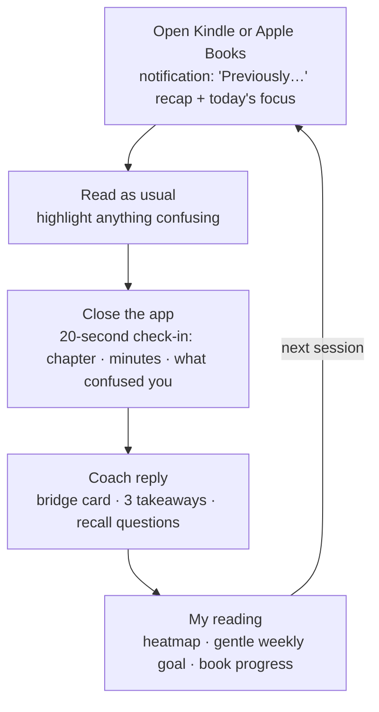

# PLAN — help-me-learn

## Vision

A personal agent that helps me **read more and understand more**, especially the technical
books I'd otherwise stall on, without being tied to any one LLM vendor. v1 built the engine
(upload, summarize, ask, usage dashboard). v2 turns it into a **reading coach that works
alongside Kindle and Apple Books**. It's for people who don't love reading but want to grow
through it.

## Who it's for: user #1

- A software engineer learning AI from the ground up, while deepening systems skills.
- Reads on **Kindle and Apple Books on iPad**, not inside this app.
- Reads five technical books in parallel:
  - *AI Engineering* (Chip Huyen)
  - *Microservices Patterns* (Chris Richardson)
  - *Observability Engineering* (2nd ed.)
  - Google's *Site Reliability Engineering*
  - *Designing Data-Intensive Applications* (Martin Kleppmann)
- **Dogfoods**: uses the app daily and builds it while learning the stack.

## Guiding principles

- **LLM-agnostic**: every model call goes through a small adapter interface
  (`LLMProvider` / `EmbeddingProvider`). Adding a provider = one new adapter file.
- **Local first, frontier by choice** *(v2)*: local models via Ollama are the default.
  OpenAI, Anthropic, Gemini and DeepSeek stay one dropdown away, and evaluation decides where
  they're worth paying for.
- **Companion, not a reader** *(v2)*: you read in Kindle or Apple Books, so the app lives
  around that reading instead of trying to replace it.
- **Say where every answer comes from** *(v2)*: your copy and page, your highlight, the table
  of contents, or the model's general knowledge. Never blur them.
- **Scaffold, don't substitute** *(v2)*: the agent helps you read; it doesn't read for you.
- **Your day is your day** *(v2)*: anything "per day" uses the reader's local timezone.
- **Explicit signals before inferred ones** *(v2)*: "this confused me" beats guessing, and
  inferred signals may only *offer* help.
- **Per chapter, just in time, cached forever** *(v2)*: cost follows what you actually read.
- **Only books you own or that are freely published; book files never enter git**: this repo
  is public, and `backend/data/` is gitignored for that reason.
- **Everything measured**: every LLM call, failures included, is logged and visible.

## v1 — done (PR #1, merged 2026-09-15)

Monorepo (FastAPI + Next.js), adapters for Mock / OpenAI / DeepSeek / Anthropic / Gemini,
RAG Q&A with citations, map-reduce summaries, usage log + dashboard, README/QUICK-GUIDE.
Verified: 11 backend tests, clean frontend build, browser E2E, live DeepSeek + OpenAI smoke test.

---

## v2 — a reading coach around Kindle and Apple Books

### Why change direction

People who don't enjoy reading rarely lack summaries. They drop out at predictable points,
and each one maps to something the agent can do. **But only if the app knows what you read
and where you struggled.** Today it only sees uploads and questions.

| Where people quit | What the agent does | What it needs to know |
|---|---|---|
| Starting feels like a chore | Offers a short session with one clear target | Your goal and where you are |
| Coming back after days away | "Previously…": a 30-second recap of last session | What you read last time |
| Hitting a hard part | A bridge card: main idea, missing prerequisite, an example | Which chapter confused you |
| No sense of progress | Reading-days heatmap, book progress | Check-ins |
| Forgetting it all | 3 takeaways now, recall questions next session | What you read, your answers |

A **bridge card** is the answer to "this confused me". It gives the section's main idea in one
sentence, what it assumes you already know (with a 2-minute primer), and one concrete example.
Then it sends you back to the book.

### The loop: "bookends" around your reading app

You read in Kindle or Apple Books, so the app wraps around those apps: a recap when you open
one, a check-in when you close it.

- **Opening** the reading app shows a notification with a two-line "Previously…" recap and
  today's focus.
- **Closing** it starts a 20-second check-in:
  - the chapter, picked from the book's contents;
  - minutes, from a tap on a preset;
  - "anything confusing?", typed or dictated.
- Both hooks are iOS Shortcuts personal automations ("when Kindle / Books is opened or
  closed"). They call the backend on the Mac over a private network (I12).
- A phone-friendly check-in page, added to the Home Screen, is the fallback and the place to
  read coach replies.
- *Spike first:* confirm the automations run without extra taps, and that the iPad reaches the
  Mac reliably.

### Books without their full text: grounding tiers

The app can't assume it has a book's text. Kindle and Apple Books purchases are
DRM-protected, and we won't strip that. Some books are read online. So each book gets the
best tier available, and **every answer is labeled with its tier** (I13):

| Tier | Source | What works |
|---|---|---|
| Full text | A DRM-free PDF/EPUB you own, or a freely published web book (the SRE book on sre.google) | Search, summaries, bridge cards with page citations |
| Your highlights | Kindle notebook export, Apple Books highlights | Review, bridge cards grounded in what you marked |
| Contents only | PDF outline, a web book's chapter list, or a pasted table of contents | Check-ins, progress, chapter-level planning |
| General knowledge | The model itself | Explanations, labeled "not from your book" |

**Why the labels matter, with evidence.** Through Ollama, the local llama3.2 (3B) answered
"what is an error budget?" in 4.7 s. But it described a budget as a count of allowed errors
per day, and it missed the core idea: 1 − SLO, a budget that lets teams trade reliability
against release speed. Plausible-but-wrong is the main risk for a technical reading coach.
The defense is grounding, labels, and an eval set (I14).

### Local-first models

- **Ollama is already installed and running** on the Mac (Apple M3, 24 GB). It serves an
  OpenAI-compatible API, so a local provider reuses the existing OpenAI-compatible adapter,
  the same path DeepSeek uses.
- *Verified:* llama3.2 answered through that API and returned token counts, so usage logging
  works unchanged.
- **Already pulled:**
  - llama3.2 (3B): fast, but imprecise on technical ideas.
  - qwen2.5-coder 1.5B / 7B: tuned for code.
  - deepseek-r1:8b: a reasoning model, slower and verbose.
  - minimax-m2:cloud: runs on Ollama's cloud, so it isn't private, but it brings MiniMax in
    through the same adapter.
- **Still to pull:** one general 7–8B instruct model for chat and one embedding model for
  search.
  - Chat candidates: llama3.1:8b or qwen3:8b.
  - Embedding candidates: nomic-embed-text or bge-m3.
  - 24 GB comfortably fits a 4-bit 7–8B model (~5 GB).
  - Choose by the bake-off (I14), not by reputation.

### Learn by building: your books map onto this codebase

Each book on your list has a concrete home in this app. Reading a chapter and then building
the matching piece is the fastest way to make it stick.

| Book | What you'll build here that uses it | Phase |
|---|---|---|
| AI Engineering | Local vs frontier model choice, RAG over your books, structured outputs, the eval harness, the coach agent | 1, 3, 5 |
| Designing Data-Intensive Applications | Event log as source of truth (`reading_events`), derived views (heatmap, weekly goal), schema evolution (migrations), a later SQLite → Postgres move | 1, 2 |
| Observability Engineering | Wide structured events for every LLM call, request IDs, then OpenTelemetry traces from page → API → model | 1, later |
| Site Reliability Engineering | SLOs for the app (check-in saves, answer latency), an error budget on the AI usage dashboard, a blameless postmortem when a provider fails | 1, 2 |
| Microservices Patterns | Keep a modular monolith; the ingestion worker is the natural first separate process, and the transactional outbox fits job enqueueing | 3, later |

### Audit of v1 (2026-09-25)

Findings come from reading the code, lint (clean), a coverage measurement on a synthetic
400-page book, the stored usage timestamps, viewing the README on GitHub, and viewing the app
at iPhone and iPad widths.

#### Product flaws

**F1 · Book summaries only cover the first 8–12% of a book.**
[summarize.py](backend/app/services/summarize.py#L10-L11) caps input at 10 batches × 12,000
chars. Measured on a 400-page book: the summary stops at page 33 (3,000 chars/page) or
page 50 (2,000 chars/page). The small "truncated" note is easy to miss.
*Fix:* P0 says exactly what was covered. P3 replaces it with cached per-chapter summaries and
a book summary built from them, which needs background jobs.

**F2 · "Per day" is UTC, and empty days disappear.**
[usage.py](backend/app/services/usage.py#L102) groups by `date(ts)` on UTC timestamps, and
[dashboard/page.tsx](frontend/src/app/dashboard/page.tsx#L45) builds the date range with
`toISOString()`. At UTC−4, anything after 8 pm counts toward tomorrow. Days with no activity
are omitted, and a one-day range draws the token chart as two floating dots.
*Why it matters:* evening is prime reading time, and the weekly goal will count days.
*Fix (P0):* the frontend sends its IANA timezone. The backend buckets days with `zoneinfo`
and zero-fills the range.

**F3 · Q&A and uploads quietly depend on OpenAI, and part of that isn't logged.**
Every question is embedded via OpenAI ([indexing.py](backend/app/services/indexing.py#L47)),
even when DeepSeek writes the answer. That call isn't logged. With no OpenAI credit, Q&A
"with DeepSeek" fails with an OpenAI error.
*Fix:* P0 logs it and labels it. P3 moves embeddings to a local model (I5).

**F4 · Uploading a big book freezes the whole backend.**
[documents.py](backend/app/routers/documents.py#L53) is an `async def` endpoint, but it runs
PDF extraction and embedding calls synchronously on the event loop. Every other request waits.
*Fix:* P0 makes it a plain `def`, so FastAPI runs it in a worker thread. P3 moves it to a
background job with progress (I4).

**F5 · Your study trail vanishes.**
Summaries, Q&A and chat live only in React state. Reload and they're gone, and
re-summarizing costs money again.
*Fix (P3):* persist summaries (per document + model) and Q&A threads.

**F6 · When the backend is down, the library looks empty, and the hint names the wrong port.**
[page.tsx](frontend/src/app/page.tsx#L21) swallows the error and shows "No documents yet".
[llm-context.tsx](frontend/src/lib/llm-context.tsx#L60) says "port 8000", but the backend
runs on 8801.
*Fix (P0):* an explicit "Can't reach the backend" state. I12 later removes the separate port
from the browser entirely.

**F7 · Answers show raw Markdown.**
[SummaryCard.tsx](frontend/src/components/SummaryCard.tsx#L38),
[QAPanel.tsx](frontend/src/components/QAPanel.tsx#L46) and
[chat/page.tsx](frontend/src/app/chat/page.tsx#L81) render plain text, so `**bold**` and
`###` show up as literal symbols.
*Fix (P0):* render Markdown with react-markdown, raw HTML disabled.

**F8 · Unclear labels and jargon.**
- Document cards say "1 page · 1k chars · 1 chunks"
  ([DocumentList.tsx](frontend/src/components/DocumentList.tsx#L42)): jargon, a plural bug,
  and "0k chars" for short documents. → "12 pages · ~25 min read".
- "indexed with the 'openai' embedder" → "Search powered by OpenAI", or hide it.
- Titles are filename slugs. → Use the PDF's title metadata, fall back to a prettified
  filename, and allow renaming.
- The model picker has no label, and its green dot means "backend connected", not
  "this key works". → Label it "AI model", and make the dot show whether the key works.
- "Summarize" and "Ask" don't name the model that will run and bill. →
  "Summarize with deepseek-chat".
- The dashboard's "LLM calls" includes embedding calls. → "API calls", or split them.
*Fix (P0).*

**F9 · Provider failures are raw, slow, and invisible.**
[chat.py](backend/app/routers/chat.py#L44) shows "Provider error: &lt;raw SDK message&gt;".
The OpenAI and Anthropic SDKs default to 10-minute timeouts with retries, and failed calls
are never logged.
*Fix (P1):* I2 + I3.

**F10 · The document list isn't usable by keyboard or touch.**
Cards are clickable `div`s ([DocumentList.tsx](frontend/src/components/DocumentList.tsx#L34)),
and the delete button stays invisible until hover
([#L48](frontend/src/components/DocumentList.tsx#L48)), so touch screens can't see it.
*Fix (P0):* real buttons, a visible focus state, and a visible delete on touch.

**F11 · Q&A can't take follow-ups.**
Each question is sent on its own.
*Fix (P3, with saved threads):* include recent turns, and rewrite a follow-up into a
standalone search query.

**F12 · The library gets slower with every book.**
[documents.py](backend/app/routers/documents.py#L105) calls `len(d.chunks)`, which loads
every chunk's text and vector just to count them.
*Fix (P0):* a COUNT query.

**F13 · A failed chat message gets stranded.**
On error, the input is cleared, so retrying means retyping.
*Fix (P0):* restore the text, or add a Retry button.

**F14 · The README's component diagram is unreadable inline on GitHub.**
The wide left-to-right layout is scaled down to tiny text; it's only legible in GitHub's
expand view.
*Fix (P0):* a top-to-bottom layout, with the providers in one row.

**F15 · On a phone, the model picker is unreachable.**
At iPhone width (375 px) the header runs out of room. The provider menu is cut off and the
model menu is completely off-screen. iPad width is fine.
*Why it matters now:* check-ins will happen on iPhone and iPad.
*Fix (P0):* collapse the picker into one compact control on small screens.

#### Infrastructure improvements (small now, big payoff later)

**I1 · Database migrations (Alembic), before any schema change.**
`create_all` ([db.py](backend/app/db.py#L87)) never alters existing tables, and every v2
feature adds tables or columns. Without migrations, each upgrade would wipe your library and
reading history.
*Verify:* upgrade a copy of the real `app.db` with nothing lost.

**I2 · Record failures, plus structured logging.**
Add `status`, `error_type` and `prompt_version` to usage rows, and emit one log line per LLM
call (provider, model, feature, latency, tokens, outcome, request id).
*Helps:* debugging from logs, a per-provider failure rate, and a first step toward the
Observability book's wide events and OpenTelemetry.

**I3 · Typed provider errors, explicit timeouts, bounded retries.**
Map each SDK's errors to `AuthError / QuotaError / RateLimitError / TimeoutError /
ProviderError`. Use roughly 60–120 s timeouts and one retry.
*Helps:* clear messages ("Anthropic: credit balance too low"), no endless spinners, and one
place to handle every provider. That includes Ollama not running.

**I4 · Background jobs + SQLite WAL mode.**
Add a `jobs` table, an in-process worker thread, and a progress endpoint. Turn on WAL and a
busy timeout.
*Why:* big uploads (F4), per-chapter summaries (F1), web-book ingestion and highlight
imports all outlive a single request.

**I5 · Local-first models and provider-independent search.**
Add an Ollama provider for chat (P1) and embeddings (P3). It's OpenAI-compatible, so it's a
few lines on the existing adapter. Store the embedder as `name:model:dim`; today only
"openai" is recorded, so changing the embedding model would crash retrieval on a vector-size
mismatch. Add re-indexing, since originals are kept.
*Helps:* free, private and offline by default, with frontier models as an option. That
fixes F3 for real.

**I6 · Structured output in the provider interface.**
Add `chat_json(messages, schema)`: each backend's native JSON mode, Pydantic validation, and
one repair retry.
*Why:* dictated check-ins, glossaries, quizzes and recall questions all need reliable JSON,
from small local models too.

**I7 · Model catalog and prices in one config file.**
Model lists are hard-coded in four adapters
([anthropic_p.py](backend/app/providers/anthropic_p.py#L11),
[gemini.py](backend/app/providers/gemini.py#L12), openai_compat.py, mock.py). Move them to
one file with env overrides, add per-model prices with a "last verified" date, and add
optional per-feature defaults (e.g. explanations on a stronger model, once the eval says so).

**I8 · Test isolation + CI.**
Tests load the real keys from `backend/.env` ([config.py](backend/app/config.py#L26)). Blank
them in `conftest.py`, and run pytest, lint and build on every PR with GitHub Actions.

**I9 · Typed API contract.**
Pydantic response models on every endpoint, with TypeScript types generated from them
(openapi-typescript), so frontend and backend can't drift apart.

**I10 · Small developer-experience items.**
- A `DATABASE_URL` setting.
- A `.python-version` pin. We run on 3.14 and libraries already warn.
- `make dev` to start both servers with one command.

**I11 · Append-only `reading_events` table** *(a Phase 2 design choice)*.
Check-ins, "confusing" notes, recaps shown, recall answers and imported highlights are stored
as events (type, book, chapter, timestamp, JSON payload).
*Helps:* new signals need no migration, and the heatmap, weekly goal, stuck detection and
coach all derive from one log (DDIA's "log as the source of truth").

**I12 · Private access from iPad and iPhone.**
- Install Tailscale on the Mac and devices.
- Expose only the frontend, over HTTPS, with `tailscale serve`. The Home Screen app's
  offline support needs HTTPS.
- Have Next.js forward `/api` to the backend, so the browser sees one origin and the backend
  stays on localhost. Check the rewrite API against the Next.js 16 docs first.
- Use a long random access token for the page and the Shortcuts.
- Keep the Mac awake while on power.
*Why:* you read and check in on the iPad, but the app runs on the Mac.
*Risk:* if the Mac is asleep or away, the device should queue check-ins and sync later.

**I13 · Grounding tiers + source labels.**
Each book records its best available tier. Every answer carries a source label: "your copy,
p. 212", "your highlight", "contents only", or "general knowledge, not from your book".
*Helps:* trust, and you learn which answers to double-check.

**I14 · Evaluation harness + model bake-off.**
Keep 20–30 questions from chapters you've actually read, with short reference answers you
approve. Run them on every model or prompt change, and report accuracy, latency and cost per
provider. A 👎 on any answer in the app adds it to the set.
*Why:* local-first makes model choice matter from day one, and plausible-but-wrong is the
failure mode (see the error-budget example above). This is also *AI Engineering*'s
evaluation chapters, applied.

### Phases

Each phase ends with WIP.md updated, tests green, and a browser pass.

**Phase 0 — Fix what's misleading (1 small PR)**
- Scope: F2, F3 (logging + labels), F4 (worker thread), F6, F7, F8, F10, F12, F13, F14,
  F15, F1 (honest coverage label), and I8.
- *Why first:* every item is small and independently checkable. CI goes in first. Days and
  phone layout must be right before check-ins exist.
- *Done when:*
  - New tests cover local-day bucketing, zero-fill, list counts and query-embedding logging.
  - Every screen works at desktop, iPad and iPhone widths, including the backend-down state.
  - `/api/health` still answers during a large upload.
  - CI is green.

**Phase 1 — Foundations for dogfooding (1 PR)**
- Scope:
  - I1 migrations, first.
  - I2 failure logging and I3 typed errors (they fix F9).
  - The Ollama chat provider, the first half of I5.
  - I6 structured output, I7 model catalog, I10.
- *Why:* this is the minimum Phase 2 needs. It stores new data safely, runs on local models,
  and turns a dictated check-in into structured data.
- *Done when:*
  - Migrations upgrade a copy of the real DB.
  - A bad key and a stopped Ollama both show clear messages and create error rows.
  - A local model answers through the app and appears on the dashboard.
  - `chat_json` returns a validated object from both Ollama and DeepSeek.

**Phase 2 — Bookends MVP: start dogfooding**
- Books don't need files. Each has a title, format, and contents (from a PDF outline, a web
  chapter list, or pasted text), and the chapter is the unit of progress.
- A phone-first check-in page, added to the Home Screen:
  - the last book is preselected;
  - a chapter picker;
  - minute presets;
  - "anything confusing?" with dictation.
  - It takes 20 seconds or less.
- I12 private access. Then the iOS Shortcuts bookends: spike first, then build.
- The coach replies with a bridge card (tier-labeled), 3 takeaways, and 1–2 recall questions
  that return in the next "Previously…".
- "My reading":
  - a heatmap;
  - a gentle weekly goal that only *observes* for your first two weeks, then suggests a goal
    slightly above your own baseline, with freeze days and no resets;
  - per-book progress.
- `reading_events` (I11). The current dashboard is renamed "AI usage".
- *Why this early:* habit data takes weeks to build up, and the weekly goal calibrates on your
  first two weeks. The loop should start collecting as soon as possible, so every later
  feature gets designed with your real data.
- *Done when:* you've checked in from the iPad for a week without touching the Mac, and the
  heatmap days match your calendar.

**Phase 3 — Grounding: text, highlights, evidence**
- I4 background jobs. Embeddings on Ollama plus re-index (the rest of I5). I13 labels
  everywhere.
- Web-book ingestion, starting with the SRE book (freely published on sre.google, one chapter
  per page).
- Highlight import:
  - Kindle's "Export notebook", shared to a Shortcut, where the Kindle app allows exporting.
  - Apple Books highlights, shared from the iPad. Or read-only from the Mac's Books data if it
    syncs over iCloud; that's a spike, and it needs your OK and a macOS permission.
- Notes ending in "?" become confusion signals, and highlights become review material.
- Saved summaries and Q&A threads with follow-ups (F5, F11), plus per-chapter summaries (F1).
- I14 eval and bake-off on your first dogfood chapters; this picks the default local models.
- *Done when:*
  - A bridge card for an SRE chapter cites the page.
  - A Kindle export shows up as highlights.
  - The bake-off has chosen the defaults.

**Phase 4 — Technical lens + cross-book links**
- A glossary and prerequisites per chapter, and a primer offered *before* a dense chapter.
- Cross-book links. Your five books overlap heavily: logs, replication, idempotency, retries,
  SLOs, tracing. A note like "you met this in DDIA's stream-processing chapter" builds the
  connections that make technical knowledge stick.
- Code and formula explainers ("show this example in Python"), plus core-vs-skim guides.
- Spaced review of recall questions and your highlights, with reminders at your usual reading
  time.

**Phase 5 — Coach agent**
- Tool calling across providers, including Ollama models that support tools.
- The coach plans your week across the five books:
  - It fits chapter length to your time: a short SRE chapter for 15 minutes, DDIA for a long
    weekend session.
  - It keeps one focus book plus one light book, to avoid scatter.
  - It notices stuck chapters: repeated "confusing" check-ins, or a book untouched for 10+
    days after a hard chapter.

**Parked — in-app PDF reader.** You read in Kindle and Apple Books, so this waits unless that
changes.

### Dogfooding routine (user #1)

- Check in after every session. The Shortcut makes it one tap.
- Give a 👎 to any wrong or unhelpful answer; it joins the eval set.
- Keep a friction log: one GitHub issue per annoyance, labeled `dogfood`. Each week, the top
  friction becomes the next small fix.

### Decisions (answered 2026-09-25)

| Question | Answer | What changed in the plan |
|---|---|---|
| Where do you read? | Kindle and Apple Books, on iPad | Companion "bookends" design; in-app reader parked; phone layout added to P0 |
| Local models? | Yes: local-first, frontier as an option | Ollama provider in P1, local embeddings in P3; the bake-off picks defaults |
| Habit style? | Gentle weekly goal fitted to your own habit; you're user #1 | Goal calibrates on two weeks of baseline; check-ins start in P2; dogfooding routine |
| Which books? | AI Engineering, Microservices Patterns, Observability Engineering 2e, SRE, DDIA | Grounding tiers; SRE book as first full-text target; cross-book links; learn-by-building map |

### Open questions (next session)

1. Which format do you have for each book: a Kindle purchase, Apple Books, a DRM-free
   PDF/EPUB you bought, or online (O'Reilly)? That sets each book's grounding tier.
2. Does Books on your Mac sync with the iPad (same iCloud account)? If so, may the backend
   read your Apple Books highlights on the Mac? Access would be read-only, and macOS will ask
   for permission.
3. Is it OK to install Tailscale on the Mac, iPad and iPhone, and keep the Mac awake while on
   power?
4. Should the weekly goal count minutes or sessions? Or let the first two weeks decide?

Phases 0 and 1 don't depend on these answers.

---

## Key decisions on record

| Decision | Choice | Why |
|---|---|---|
| Q&A grounding | Embeddings RAG | Better answers on long books; interface hides the store |
| Vector store | numpy over SQLite blobs | Personal scale; zero extra infra; swappable later |
| Providers | Mock, OpenAI, DeepSeek, Anthropic, Gemini; Ollama in v2 | DeepSeek and Ollama share the OpenAI wire format |
| Streaming | Not yet | Simpler adapters + usage logging first |
| DB | SQLite (SQLAlchemy) | Single file, zero setup, fine for one user |
| Reading surface *(v2, decided)* | Kindle + Apple Books; this app is a companion | That's where the reading happens |
| Default models *(v2, decided)* | Local via Ollama; frontier optional | Free, private, offline; the bake-off decides exceptions |
| Embeddings *(v2, decided)* | Local via Ollama (model picked by bake-off) | Removes the hidden OpenAI dependency (F3) |
| Habit mechanics *(v2, decided)* | Gentle weekly goal, calibrated on two weeks of baseline | Fits the reader's real habit; a missed day erases nothing |
| Day boundary *(v2, proposed)* | Reader's IANA timezone | Evening reading must count for today |
| Reading data *(v2, proposed)* | Append-only `reading_events` table | New signals need no migration; one source for every view |
| Chapters *(v2, proposed)* | PDF outline, web chapter list, or pasted contents | Works for every format, at zero LLM cost |
| Grounding *(v2, proposed)* | Tiers with a source label on every answer | Small models + missing text = confident errors |
| Device access *(v2, proposed)* | Tailscale + one origin via Next.js | Private, HTTPS, no public exposure |
