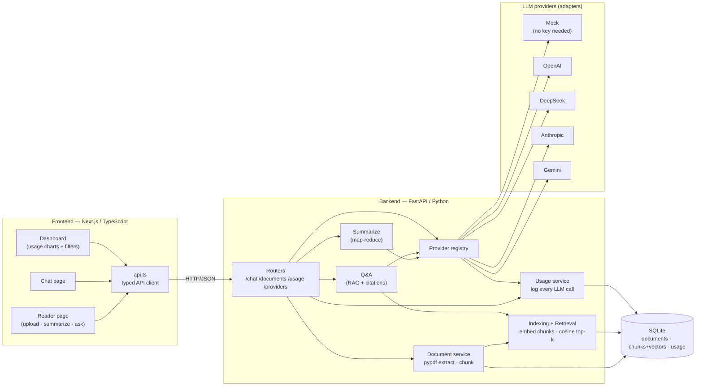
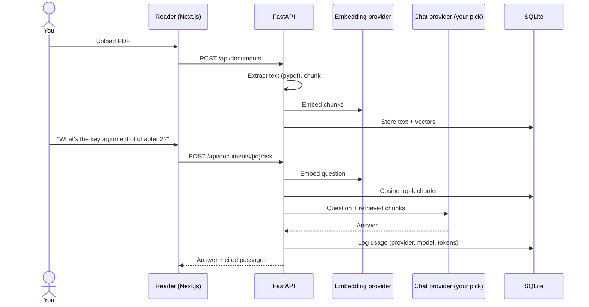

# help-me-learn

A personal, **LLM-agnostic learning agent**: upload a book or article (PDF/text), get fast
summaries, ask questions grounded in the document (RAG with citations), and watch your own
usage patterns on a dashboard — while switching freely between OpenAI, DeepSeek, Anthropic,
Gemini, or an offline mock provider.

- **Frontend**: Next.js + TypeScript + Tailwind (Reader, Chat, Dashboard)
- **Backend**: Python + FastAPI (provider adapters, RAG pipeline, SQLite usage log)
- **Setup & usage**: see [QUICK-GUIDE.md](QUICK-GUIDE.md) · **Roadmap**: [PLAN.md](PLAN.md) · **Current status**: [WIP.md](WIP.md)

## How the pieces fit

## The core flow: upload a book, ask a question

Every LLM call — chat, summarize, or Q&A — lands one row in the usage log, which is what the
dashboard aggregates (calls per day, provider share, tokens over time, filterable by date,
provider, model, and feature).
